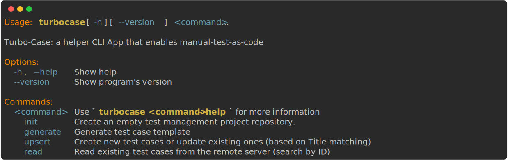

# TurboCase



[](https://conventionalcommits.org)


Enable manual-test-case-as-code for [Testiny](https://www.testiny.io/).

## Table of contents
- [TurboCase](#turbocase)
  - [Table of contents](#table-of-contents)
  - [Installation](#installation)
  - [Usage](#usage)
    - [Creating a YAML test file](#creating-a-yaml-test-file)
    - [Uploading test case to Testiny](#uploading-test-case-to-testiny)
    - [Updating a test case](#updating-a-test-case)
    - [Reading a test case](#reading-a-test-case)
    - [Using the `upsert` command](#using-the-upsert-command)
    - [Extra Information](#extra-information)
  - [Contribution Guide](#contribution-guide)
- [References](#references)


## Installation

Install from PyPI (recommended):
```shell
TODO (use pipx not pip)
```

Or, from GitHub (development version):
```shell
pipx install git+https://github.com/benoapp/turbo-case.git
```

Next, configure `turbocase` by running the following:
```shell
turbocase config --api-key <YOUR_TESTINY_API_KEY>
```

## Usage

### Creating a YAML test file

The YAML file should contain `title`, `preconditions`, `steps`, `expected results`, and `project id` (case sensitive), as in the following example:

```yaml
title: Payment Gateway Works
preconditions:
    - User logged in
    - Cart is not empty
steps:
    - Click on checkout 
    - Fill credit card information
    - Click on pay
expected results:
    - Success
project id: 1
```

### Uploading test case to Testiny

A test case can be created and uploaded to [Testiny](https://www.testiny.io/) using the following:

* Single file

```shell
turbocase create test_case.yaml
```

* Multiple files

```shell
turbocase create test_one.yaml test_two.yaml

# OR, using a folder
turbocase create test_cases/*
```

### Updating a test case

To update a test case, run the following:
```shell
turbocase update --id 192 new_test_case.yaml
```

### Reading a test case

To read a test case, run the following
```shell
turbocase read --id 192
```

### Using the `upsert` command
To create or update an existing test case, use the `upsert` command. This command will try to update an existing test case with the same title instead of creating a new one. If no such test case exists, a new one will be created automatically.

```shell
turbocase upsert test_case.yaml
```

### Extra Information
For more information, run `turbocase --help` or `turbocase <command> --help`.

## Contribution Guide

If you have suggestions, please create a [GitHub Issue](https://github.com/benoapp/turbo-case/issues/new/choose).

# References

- [Testiny API Documentation](https://www.testiny.io/docs/rest-api/testiny-api/)
- [Conventional Commits](https://www.conventionalcommits.org/en/v1.0.0/)
